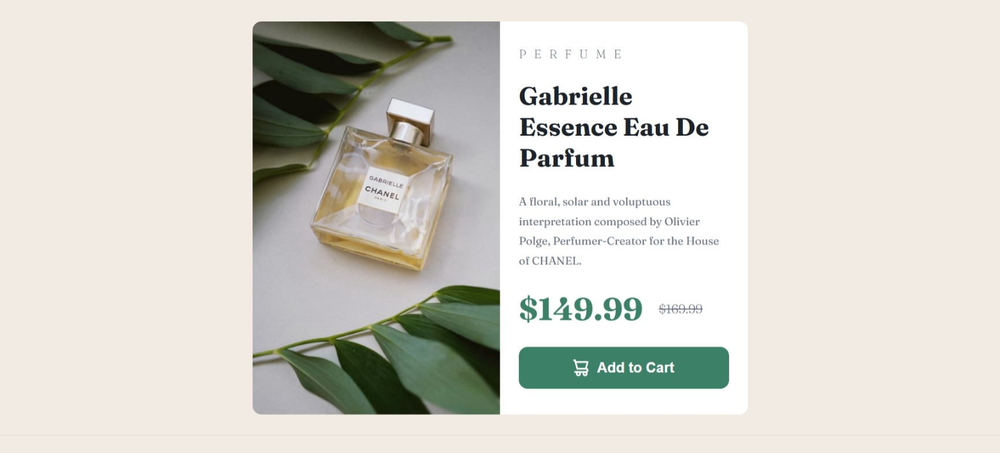

# Frontend Mentor - Product preview card component solution

This is a solution to the [Product preview card component challenge on Frontend Mentor](https://www.frontendmentor.io/challenges/product-preview-card-component-GO7UmttRfa). Frontend Mentor challenges help you improve your coding skills by building realistic projects.

## Table of contents

- [Overview](#overview)
  - [The challenge](#the-challenge)
  - [Screenshot](#screenshot)
  - [Built with](#built-with)
  - [What I learned](#what-i-learned)
- [Author](#author)

## Overview

- This is a Frontend Mentor Challenge That view a product card with a responsive design using media query .
- In this challenge i just use pure CSS code with no framework.

### The challenge

Users should be able to:

- View the optimal layout depending on their device's screen size
- See hover and focus states for interactive elements

### Screenshot

### Built with

- Semantic HTML5 markup
- CSS custom properties
- Flexbox
- CSS Grid
- Mobile-first workflow

### What I learned

In this challenge i learned many thing useful like How to use flex box in the right way and between deferent screen sizes .

also, I used medial query to change flex direction and width and styles for screens that min-width for it is 768px.

Finally i learned to begin the code with mobile design first the adjust it to bigger screens (Table, Laptop and Computer) because, that make the website load faster and many users user there phone to search on web.

## Author

- Linked in - [Mohamed Amosh](https://www.linkedin.com/in/mohamed-amoush-85a75734a/)
